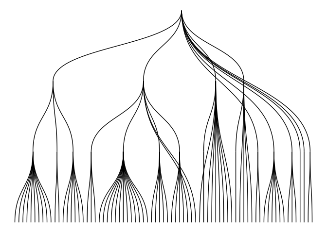
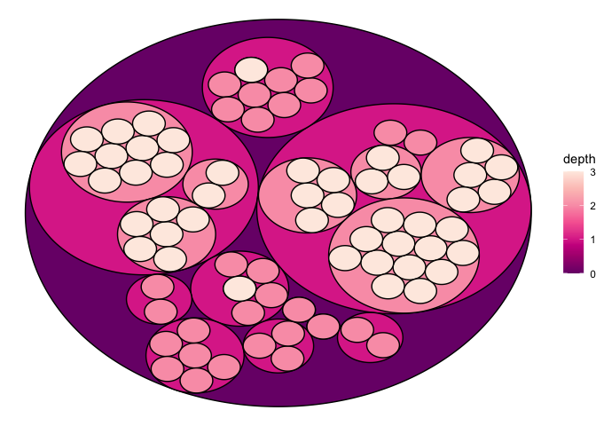

tidytuesday march 30- makeup shades
================
Ingrid Zoll
3/30/2021

This week’s tidy tuesday provided makeup shade data, which was
interesting and challenging to work with! With the given name
categorizations, I decided to take a closer look at makeup names that
were categorized as either rocks or gems, the common names within those
groups, and their shades.

``` r
library(tidyverse)
library(ggraph)
library(igraph)
library(stringr)
```

``` r
allCategories <- readr::read_csv('https://raw.githubusercontent.com/rfordatascience/tidytuesday/master/data/2021/2021-03-30/allCategories.csv')
```

First, data wrangling!

``` r
gems <- allCategories %>%
  filter(str_detect(categories, "gem")) %>%
  distinct(brand, name, lightness, hex) %>%
  mutate(name_group = case_when(str_detect(name, "ivo") ~ "ivory",
                                str_detect(name, "amber") ~ "amber",
                                str_detect(name, "alabaster") ~ "alabaster",
                                str_detect(name, "shell") ~ "shell",
                                str_detect(name, "pearl") ~ "pearl",
                                str_detect(name, "bone") ~ "bone", 
                                TRUE ~ "other")) %>%
  mutate(category = "gem")


rocks <- allCategories %>%
  filter(str_detect(categories, "rock")) %>%
  distinct(brand, name, lightness, hex)  %>%
  mutate(name_group = case_when(str_detect(name, "sand") ~ "sand",
                                str_detect(name, "sienna") ~ "sienna",
                                str_detect(name, "desert") ~ "desert",
                                str_detect(name, "pebble") ~ "stone/pebble",
                                str_detect(name, "dune") ~ "dune",
                                str_detect(name, "stone") ~ "stone/pebble",
                                TRUE ~ "other")) %>%
  mutate(category = "rock")


full_data <- rocks %>%
  full_join(gems)
```

    ## Joining, by = c("brand", "name", "hex", "lightness", "name_group", "category")

``` r
full_count<-full_data %>%
  group_by(category, name_group) %>%
  count(name_group) %>%
  mutate(lightness = 0.25)
```

Now, some graphing!

``` r
full_shades <- full_data$hex

ggplot(full_data, aes(x=name_group, y=lightness))+
  geom_violin(color="black", fill=NA, size=.2)+
  geom_point(shape=21, fill=full_shades, size=2, position="jitter", stroke=.3, alpha=.9)+
  facet_grid(vars(category), scales="free")+
  geom_label(data=full_count, aes(label=n), size=2.5)+
  coord_flip()+
  labs(x="name group", title="minerals in makeup", subtitle="rock and gem categorized makeup names and their shades")+
  theme_minimal()+
  ggsave("violin_dot_makeup.png")
```

<!-- -->

Lastly, some fun with hierarchy plots!  
Nodes are:  
1. brand (10 randomly selected)  
2. name group (as created in the above wrangling)  
3. makeup name

I’m still getting the hang of using `ggraph` so these aren’t the best
graphs, but I had a lot of fun making them!

``` r
smallbrands <- count(full_data, brand) %>%
  arrange(desc(n)) %>%
  sample_n(10)

brandlist <- smallbrands$brand
```

``` r
full_data2 <- full_data %>%
  filter(brand %in% c(brandlist)) %>%
  mutate(origin = "origin")

set1 <- full_data2 %>%
  select(origin, brand) %>%
  distinct() %>%
  rename("from"="origin", "to"="brand")

set2 <- full_data2 %>%
  select(brand, name_group) %>%
  rename("from" = "brand", "to"="name_group")

set3 <- full_data2 %>%
  select(name_group, name) %>%
  rename("from"="name_group", "to"="name")

hierarchy <- rbind(set1, set2, set3)
vertices <- data.frame(name = unique(c(as.character(hierarchy$from), as.character(hierarchy$to))) ) 
mygraph <- graph_from_data_frame( hierarchy, vertices=vertices)
```

``` r
ggraph(mygraph, layout='dendrogram', circular=FALSE) + 
  geom_edge_diagonal() +
  theme_void() +
  theme(legend.position="none")
```

<!-- -->

``` r
ggraph(mygraph, layout = 'circlepack') + 
  geom_node_circle(aes(fill = depth)) +
  scale_fill_distiller(palette = "RdPu") +
  theme_void()
```

<!-- -->
